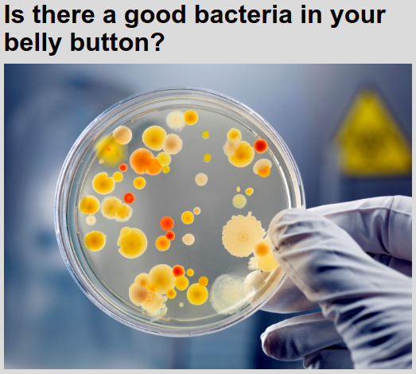
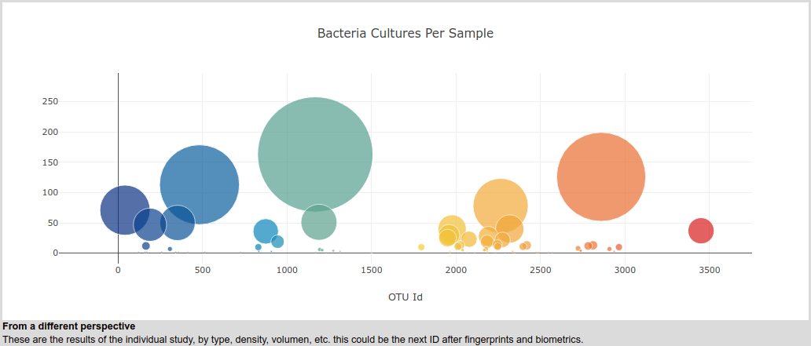

# Plotly
Bootcamp 12

In this example we were requested to use D3, Plotly and JavaScript to report the discoveries of the scientists about the belly button bacterias.
The information was provided as JSON, so we just focused on the presentation.

### The information analysis
In recent years the scientists have been making analysis and studies around what live in the belly button, as it was the first conctact of a human being with the exterior, feed source, emotions connection with the mother, etc.
They took a group and started the tests culturing bacteria samples.

Once they got the results and we plot them using bubble graphs we were able to confirmed graphically what the scientists have told us: "There no identical sample among the whole group".
When the scientist developed that theory the community was in shock, as this could be a new way to identify a person.

### However !
The possible "Belly Button Bacteria ID" couln't be the as contundent as the scientists would like, as it's related on the personal hygiene of the subject, so, changing habits make imposible to have the exact same bacteria sample.

Nevertheless, the discoveries are impressive, as we are now aware that many infections can be derived from the belly button bacteria proliferation, and many recommendations can be made around.

